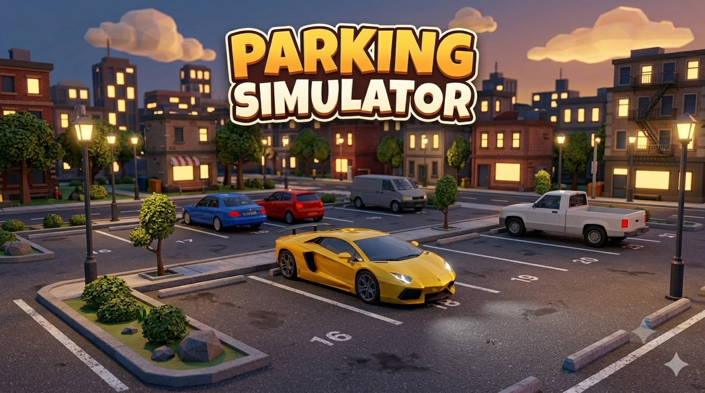
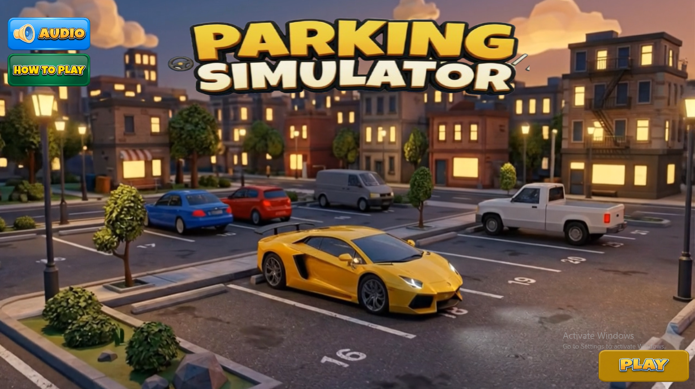
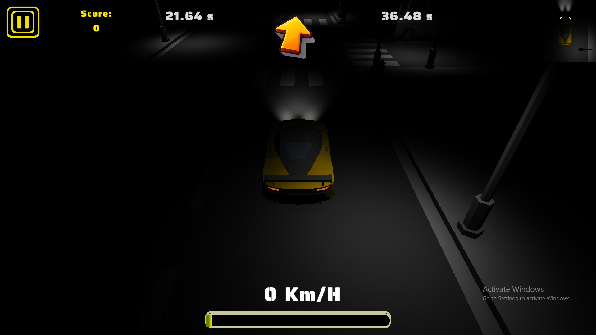
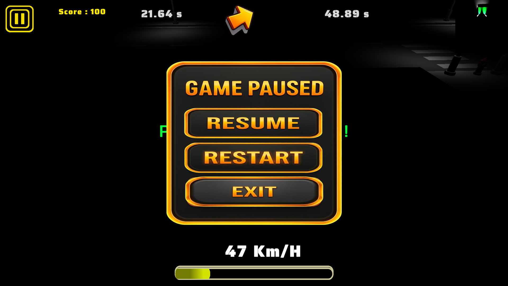
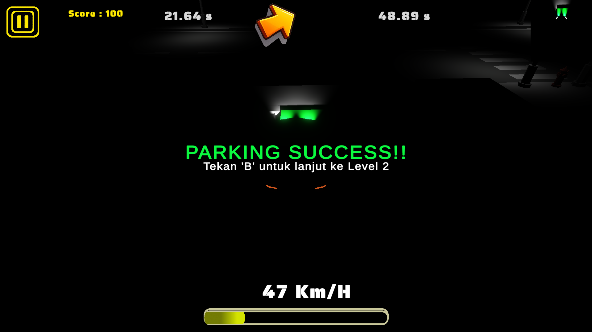

<p align="center">
  
</p>

<h1 align="center">🚗 Parking Simulator</h1>

<p align="center">
A 3D parking simulation game developed using <b>Unity 6</b> and <b>C#</b>, challenging players to complete increasingly difficult parking missions with realistic vehicle controls, manual gear transmission, and immersive gameplay.
</p>

<p align="center">


</p>

---

# 🎮 About The Project

Parking Simulator is a 3D simulation game where players must drive and park a vehicle accurately within a designated parking area before time runs out. The game focuses on realistic driving mechanics using a manual gear system, challenging players to master speed control, steering precision, and parking accuracy across multiple levels.

The project was developed as part of a Unity Game Development course while emphasizing clean gameplay mechanics, modular scripting, and user-friendly interface design.

---

# 🎥 Gameplay Demo

▶ **Watch Full Gameplay**

[https://youtu.be/NGfSGcj-uqE?si=mF_ESYc3zACO870g]

---

# 📸 Screenshot Gallery

## Main Menu

<p align="center">

</p>

---

## Gameplay

<p align="center">

</p>

---

## Pause Menu

<p align="center">

</p>

---

## Success Screen

<p align="center">

</p>

---

# ✨ Key Features

## 🚗 Gameplay

- Multi-Level Parking Missions
- Manual Gear System (R, N, 1–5)
- Realistic Vehicle Movement
- Accurate Parking Detection
- Countdown Timer
- Win & Game Over System

---

## 🎵 Audio

- Background Music
- Engine Idle Sound
- Engine Running Sound
- Finish Sound Effect
- Game Over Sound
- Audio ON/OFF Toggle

---

## 🖥 User Interface

- Loading Screen
- Main Menu
- Pause Menu
- Restart Level
- Exit to Main Menu
- Success Screen
- Game Over Screen

---

## 🏆 Progression

- Best Record System
- Current Record Tracking
- Multi-Level Progression
- Scene Transition

---

# ⚙ Technologies Used

| Technology | Description |
|------------|-------------|
| Unity 6 | Game Engine |
| C# | Gameplay Programming |
| Visual Studio | Code Editor |
| TextMeshPro | User Interface |
| Git | Version Control |
| GitHub | Repository Hosting |

---

# 🏗 Game Architecture

```
Player Input
      │
      ▼
Car Controller
      │
      ▼
Vehicle Physics
      │
      ▼
Parking Detection
      │
      ▼
Game Manager
      │
 ┌────┴─────────┐
 ▼              ▼
Success     Game Over
      │
      ▼
UI Manager
```

---

# 📂 Project Structure

```
Assets
│
├── Audio
├── Materials
├── Models
├── Prefabs
├── Scenes
├── Scripts
├── Textures
├── UI
│
Packages
ProjectSettings
README.md
```

---

# 🎯 Development Challenges

During development, several technical challenges were encountered and successfully resolved:

- Designing a realistic manual gear transmission system.
- Implementing smooth vehicle movement and steering mechanics.
- Creating an accurate parking detection system.
- Managing scene transitions between multiple levels.
- Developing responsive UI for desktop gameplay.
- Integrating background music and sound effects.
- Implementing pause, restart, and exit functionality.

---

# 🚀 Project Outcome

✔ 3 Interactive Scenes

✔ Realistic Parking Simulation

✔ Manual Gear System

✔ Multi-Level Gameplay

✔ Dynamic Audio System

✔ Loading Scene

✔ Pause Menu

✔ Main Menu

✔ Success & Game Over System

✔ Best Record Tracking

---

# 🎮 Controls

| Key | Action |
|-----|--------|
| ↑ | Accelerate |
| ↓ | Brake |
| ← | Turn Left |
| → | Turn Right |
| R | Reverse Gear |
| N | Neutral |
| 1-5 | Forward Gear |

---

# 👨‍💻 Developer

## Adytia Damar Panuntun

Informatics Student

Wijaya Kusuma University Surabaya

### Areas of Interest

- Unity Game Development
- Artificial Intelligence
- Web Development
- Interactive Systems
- Software Engineering

---

### GitHub

https://github.com/Adytia250

### Portfolio

https://glints.com/id/profile

### Demo Video

https://youtu.be/NGfSGcj-uqE?si=mF_ESYc3zACO870g

### Email

adytiaoblek07@gmail.com

---

<p align="center">

⭐ If you like this project, don't forget to leave a star!

Made with ❤️ using Unity 6 & C#

</p>
